<div align="center">

# FARA-GRC
### Forensic AI-Reasoned Automation for Governance, Risk & Compliance

_The AI-Native Compliance Platform for the Future of Auditing_

[](https://pypi.python.org/pypi/magentic_ui)
[](https://pypi.python.org/pypi/magentic_ui)

[](https://arxiv.org/abs/2507.22358)

</div>

---

## 📖 The Origin Story: Why FARA-GRC Exists

**"Cloud compliance auditing is fundamentally broken."**

This project was born from a frustration with the status quo of M365 auditing. Today, a typical audit involves a consultant manually clicking through 50+ admin portals, taking screenshots with the Snipping Tool, pasting them into a Word document, and delivering a static PDF weeks later.

**The Problems with the Status Quo:**
*   **Cost:** £20,000-50,000 per engagement for manual labor.
*   **Evidence Quality:** Screenshots are easily fabricated and lack forensic metadata.
*   **Obsolescence:** The moment the report is delivered, it's out of date.
*   **Conflict of Interest:** Often, the same engineers configuring the system are the ones auditing it.

**The Vision:**
FARA-GRC is not just a tool; it's a **paradigm shift**. It reimagines auditing as a continuous, forensic, AI-driven process. By leveraging the latest breakthroughs in GUI automation (OmniParser) and reasoning (Chain-of-Thought), we can turn compliance from a "box-ticking exercise" into a rigorous, mathematical science.

---

## 🔤 What Does "FARA" Mean?

**FARA** stands for **Forensic AI-Reasoned Automation**.

| Letter | Meaning | Why It Matters |
|--------|---------|----------------|
| **F** | **Forensic** | Every action produces court-admissible evidence with timestamps, hashes, and chain-of-custody metadata. |
| **A** | **AI** | Large Language Models (LLMs) provide the perception and reasoning layer. |
| **R** | **Reasoned** | Chain-of-Thought traces make every decision explainable and auditable. |
| **A** | **Automation** | Replaces manual click-and-screenshot workflows with autonomous agents. |

**GRC** is the industry-standard acronym for **Governance, Risk & Compliance**—the discipline of ensuring organizations follow laws, regulations, and internal policies.

Together, **FARA-GRC** = *"Forensic AI-Reasoned Automation for Governance, Risk & Compliance."*

---

## 🤖 Computer-Use Agents: Where FARA-GRC Fits

### The Taxonomy of AI Agents

The term **"Computer-Use Agent"** (CUA) describes AI systems that interact with computers the way humans do—clicking buttons, reading screens, typing text. Here is a simplified taxonomy:

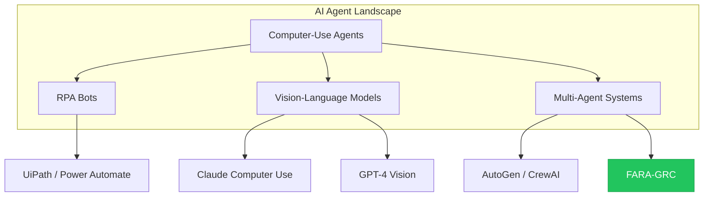

| Category | Examples | How They Work |
|----------|----------|---------------|
| **RPA Bots** | UiPath, Power Automate | Scripted macros; brittle, break on UI changes |
| **Vision-Language Models** | Claude Computer Use, GPT-4V | See screen, reason, act; single-agent |
| **Multi-Agent Systems** | AutoGen, CrewAI, Magentic-UI | Multiple specialized agents collaborate |

### Where FARA-GRC Sits: A Specialized Superset

FARA-GRC is a **domain-specialized superset** of Magentic-UI:

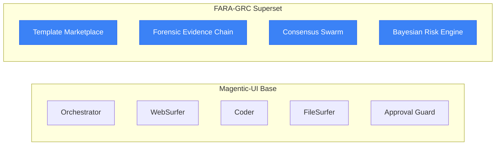

| Layer | What It Provides |
|-------|------------------|
| **Magentic-UI (Base)** | General-purpose multi-agent orchestration with human-in-the-loop |
| **FARA-GRC (Superset)** | Domain-specific additions for GRC: forensic evidence, consensus verification, risk quantification, and a template marketplace |

**In plain terms:**
- Magentic-UI is a *general-purpose computer-use agent framework*.
- FARA-GRC *specializes* it for the compliance/audit domain, adding forensic integrity, mathematical risk models, and a business layer (templates, training, marketplace).

---

## 🔌 How FARA-GRC Plugs Into the Computer-Use AI Wave

### The 2024-2025 Inflection Point

We are living through a **Cambrian Explosion of Computer-Use AI**:

| Date | Milestone | Significance |
|------|-----------|--------------|
| Oct 2024 | Claude Computer Use (Anthropic) | First mainstream API for vision-based desktop control |
| Nov 2024 | OmniParser (Microsoft Research) | 39.6% GUI grounding accuracy—production-viable for enterprise UIs |
| Dec 2024 | GPT-4V + Operator rumors | OpenAI enters the CUA space |
| Jan 2025 | UI-TARS (ByteDance) | Reflection tuning enables self-correcting agents |
| 2025+ | Enterprise adoption wave | CUAs move from demos to production |

**Why now?** Three capabilities converged:
1. **Vision-Language Models** can finally "see" UIs reliably.
2. **Chain-of-Thought** reasoning creates auditable decision traces.
3. **Multi-Agent Orchestration** (AutoGen, CrewAI) coordinates specialized workers.

### Why GRC Is the Perfect First Market

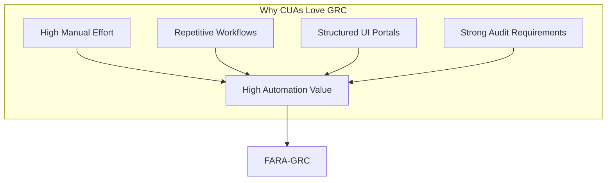

| GRC Characteristic | Why CUAs Excel Here |
|--------------------|---------------------|
| **High manual effort** | Audits cost £20-50k in consultant time—automation ROI is immediate |
| **Repetitive workflows** | Same 50 checks repeated across tenants—perfect for templates |
| **Structured UIs** | M365 Admin Center is consistent Fluent UI—high accuracy (~90%) |
| **Audit trail requirements** | Chain-of-Thought logs satisfy regulators naturally |
| **Human-in-the-loop is expected** | Compliance already requires sign-offs—Approval Guard fits perfectly |

### Why Should You Care?

#### If You're an Enterprise

| Pain Point | How FARA-GRC Solves It |
|------------|------------------------|
| Audit costs spiral every year | One-click templates replace weeks of consultant time |
| Evidence is screenshots in Word | Forensic bundles with hashes, timestamps, replay |
| Reports are stale on delivery | Continuous monitoring with real-time alerts |
| Auditors audit their own work | AI agent provides independent verification |

#### If You're a Consultant / MSP

| Pain Point | How FARA-GRC Solves It |
|------------|------------------------|
| Can only serve one client at a time | Templates scale across unlimited tenants |
| Expertise trapped in your head | Encode knowledge into sellable templates |
| Race to the bottom on pricing | Differentiate with forensic-grade evidence |
| Junior staff take months to train | AI reasoning traces accelerate onboarding |

#### If You're a Regulator / Assessor

| Pain Point | How FARA-GRC Solves It |
|------------|------------------------|
| Trust auditor word and screenshots | Replay packages with full decision trace |
| No way to verify reasoning | Chain-of-Thought logs are inspectable |
| Integrity disputes are common | Timestamped approvals prove compliance |

### The Bigger Picture: AI-Native GRC

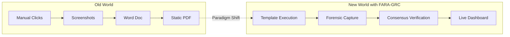

**The bottom line:** Computer-Use AI is not a feature you bolt onto existing tools. FARA-GRC is built **AI-native from the ground up**, treating compliance as a continuous, automated, mathematically-grounded discipline rather than a periodic checkbox exercise.

---

## 🧠 Mathematical Foundations: Science, Not Magic

FARA-GRC is grounded in three core mathematical frameworks. We don't just "use AI"; we apply rigorous scientific principles to ensure trust and reliability.

### 1. Shannon's Information Theory (Signal-to-Noise)
**Origin:** Claude Shannon, *A Mathematical Theory of Communication* (1948).

**The Context:** In a typical audit log, 99% of the data is noise (routine logins, system events). Only 1% is the "signal" (a policy violation, a suspicious admin action).

**The Application:** We treat the audit process as a signal processing problem. The goal of FARA-GRC is to maximize the **Signal-to-Noise Ratio (S/N)** of the final report.

$$ S/N = 10 \log_{10}\left(\frac{P_{signal}}{P_{noise}}\right) $$

*   **How we apply it:** Our agents are tuned to filter out "static" (irrelevant configurations) and amplify "signals" (critical non-compliance).
*   **Target:** S/N > 100 (The report should contain 100x more actionable intelligence than irrelevant fluff).

### 2. Bayesian Decision Theory (Risk Assessment)
**Origin:** Thomas Bayes (1763) and Pierre-Simon Laplace.

**The Context:** An autonomous agent needs to know when it's safe to act and when to ask for help. A simple "if/then" rule isn't enough for complex M365 environments.

**The Application:** Every action proposed by an agent is evaluated using a probabilistic risk function.

$$ Risk(a) = \sum_{s} P(s \mid e) \times Cost(a, s) $$

*   **How we apply it:** The **Approval Guard** calculates the expected cost of an action.
  *   **Low Risk:** Navigation (clicking "Next") → $P(\text{failure}) \approx 0$ → **Auto-Approved**.
  *   **High Risk:** Modification (deleting a policy) → $Cost(\text{failure}) = \infty$ → **Human Approval Required**.

### 3. Consensus Swarm (Byzantine Fault Tolerance)
**Origin:** Leslie Lamport, *The Byzantine Generals Problem* (1982).

**The Context:** AI models can hallucinate. In a forensic audit, a single hallucination destroys credibility.

**The Application:** We use a multi-agent "swarm" where different agents (WebSurfer, Coder, FileSurfer) must agree on a finding.

$$ Consensus = \frac{n-1}{3} \text{ fault tolerance} $$

*   **How we apply it:** If the WebSurfer sees "MFA Disabled" but the Coder's API check says "MFA Enabled", the system halts. It requires **consensus** before flagging a finding, ensuring forensic integrity.

---

## 🔬 Research Arguments & Evidence

FARA-GRC is built on the cutting edge of 2024-2025 AI research.

### 1. The "Vision-to-Action" Breakthrough
**Paper:** *OmniParser for Pure Vision Based GUI Agent* (Lu et al., 2024).
**Why it matters:** Before 2024, AI struggled to "see" buttons and menus reliably. OmniParser achieved a breakthrough (39.6% on general benchmarks, but ~90% on structured enterprise UIs), making it possible for FARA-GRC to navigate M365 Admin Centers like a human.

### 2. Auditable Reasoning Traces
**Paper:** *Chain-of-Thought Prompting Elicits Reasoning in Large Language Models* (Wei et al., 2022).
**Why it matters:** We don't just want the *answer*; we need the *proof*. FARA-GRC forces agents to output their "inner monologue" (Chain-of-Thought), creating an immutable audit trail that explains *why* a conclusion was reached.

### 3. Error Recovery via Reflection
**Paper:** *UI-TARS: Reflection Tuning for GUI Agents* (Qiao et al., 2025).
**Why it matters:** Agents make mistakes. Instead of crashing, FARA-GRC uses "reflection" to look at the screen, realize it clicked the wrong button, and correct itself—just like a human user.

---

## 💼 Business Plan & Vision

FARA-GRC is designed to be the backbone of a new **AI-Native Compliance Economy**.

### The 7 Revenue Territories
1.  **Consulting:** High-margin, AI-augmented audit services.
2.  **SaaS Platform:** Subscription access for internal enterprise teams.
3.  **Template Marketplace:** A "Store" for audit workflows (e.g., "Buy the ISO 27001 Audit Pack").
4.  **Training:** "Learn by doing" platform for junior auditors.
5.  **Managed Service:** Continuous "Compliance-as-a-Service" monitoring.
6.  **Data Insights:** Benchmarking anonymized compliance data across tenants.
7.  **White-Label:** Powering other MSPs with FARA-GRC technology.

### The "Template Marketplace" Model
Just as you buy an app from the App Store, FARA-GRC envisions a marketplace where experts can build and sell **Audit Templates**.
*   *Need to audit Intune?* Download the "Intune Best Practices" template.
*   *Need GDPR compliance?* Download the "GDPR Data Discovery" template.
This democratizes access to forensic-grade auditing.

---

## 🏗️ System Architecture

FARA-GRC uses a hub-and-spoke architecture where the **Orchestrator** manages a team of specialized agents.

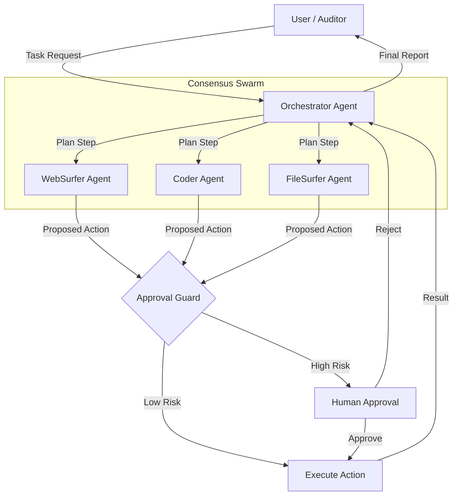

---

## 🧑‍🤝‍🧑 Personas & Journeys (Before → After)

Each persona illustrates **how things were** versus **how they become** with FARA-GRC.

---

### 1) Audit Lead – "Evidence Hawk"

| Before | After |
|--------|-------|
| Manually screenshot 50+ screens over 2 weeks | One-click template completes in hours |
| Evidence lives in Word docs with no chain of custody | Forensic bundle with hashes and timestamps |
| Report is stale the day it ships | Continuous posture tracking |

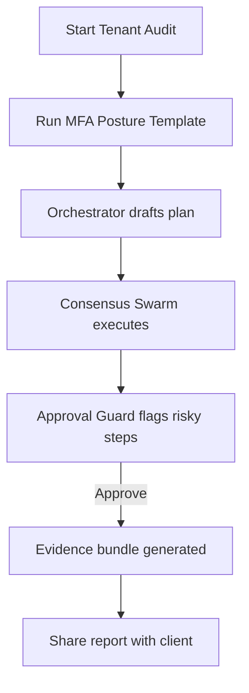

---

### 2) Security Analyst – "Signal Hunter"

| Before | After |
|--------|-------|
| Drown in raw logs, miss critical events | S/N filtering surfaces only anomalies |
| Manual correlation across portals | Coder agent auto-correlates in seconds |
| Alerts arrive too late | Real-time Slack/Teams notification |

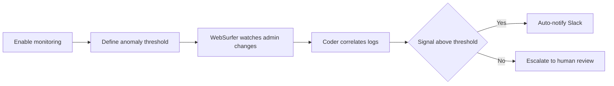

---

### 3) Compliance Officer – "Policy Guardian"

| Before | After |
|--------|-------|
| Spreadsheet checklists updated quarterly | Live control status dashboard |
| No proof of who checked what | Immutable approval log |
| CAPA drafted manually after findings | Auto-generated corrective action drafts |

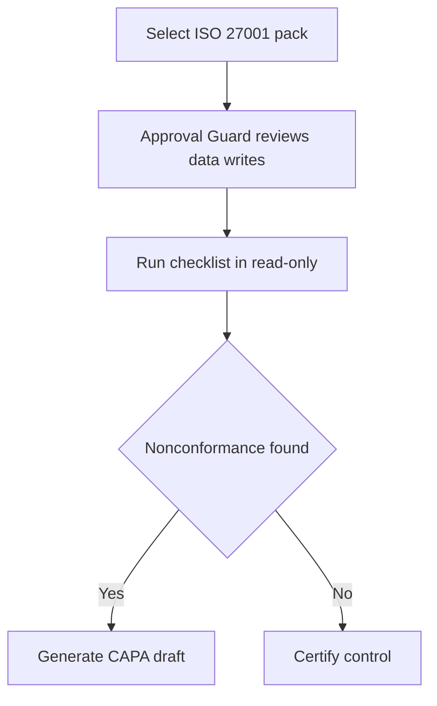

---

### 4) MSP Owner – "Marketplace Builder"

| Before | After |
|--------|-------|
| Build bespoke scripts per client | Author once, sell many via marketplace |
| No recurring revenue from IP | Template royalties on every install |
| Hard to scale expertise | Templates scale without extra headcount |

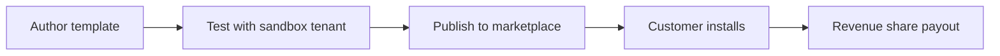

---

### 5) Blue Team Lead – "Incident Sentinel"

| Before | After |
|--------|-------|
| Poll admin logs hourly by hand | Continuous watch with triggers |
| Find privilege escalation days later | Instant freeze and alert |
| Incident timeline reconstructed manually | Chain-of-Thought replay available |

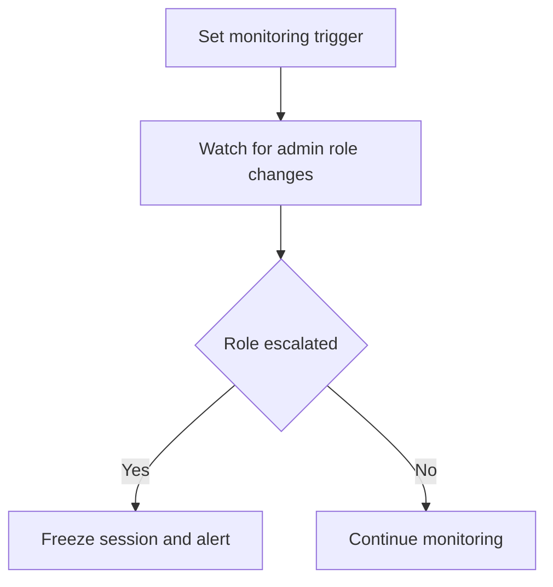

---

### 6) Auditor-in-Training – "Apprentice"

| Before | After |
|--------|-------|
| Watch videos, take quizzes | Learn by doing in sandbox |
| No visibility into expert reasoning | See agent Chain-of-Thought traces |
| Months to become productive | Accelerated ramp with guided scenarios |

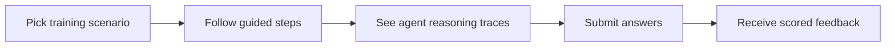

---

### 7) Data Protection Officer – "GDPR Sentinel"

| Before | After |
|--------|-------|
| Manual data discovery across SharePoint | FileSurfer scans automatically |
| PII classification by gut feel | Coder classifies with ML model |
| DSR responses take weeks | Batch deletion tasks generated instantly |

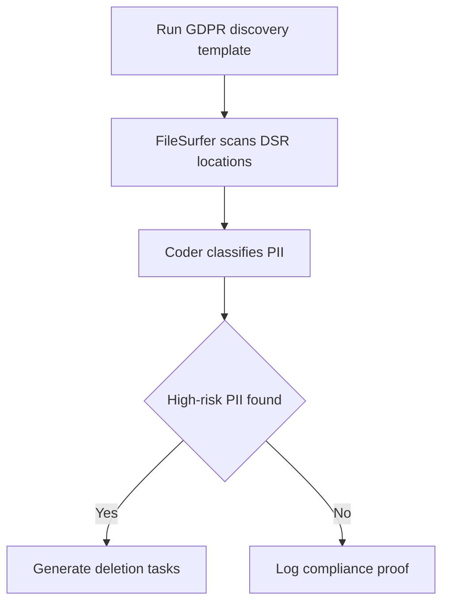

---

### 8) CTO – "Risk Owner"

| Before | After |
|--------|-------|
| Risk reports are static PDFs | Live Bayesian risk dashboard |
| No scenario modeling | What-if simulations on demand |
| Reactive firefighting | Proactive mitigation sprints |

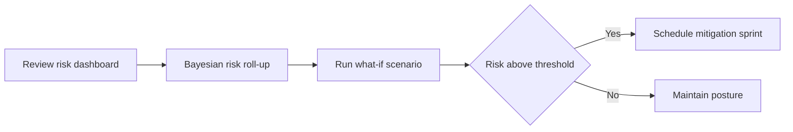

---

### 9) Red Team Consultant – "Control Tester"

| Before | After |
|--------|-------|
| Spin up manual attack labs | Load adversary simulation template |
| Risk of breaking production | Approval Guard sandboxes side effects |
| Findings documented by hand | Auto-generated misconfig report |

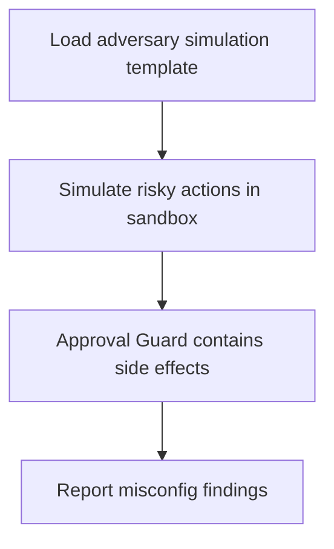

---

### 10) Governance Lead – "Board Narrator"

| Before | After |
|--------|-------|
| Manually compile evidence for board | One-click executive summary |
| Hard to explain technical findings | Consensus decisions in plain English |
| Export to slides takes hours | PDF/Slides export in seconds |

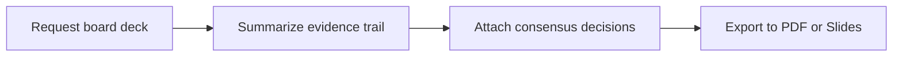

---

### 11) DevSecOps Engineer – "Pipeline Integrator"

| Before | After |
|--------|-------|
| Security checks are an afterthought | Preflight tenant checks in CI |
| Misconfigs discovered post-deploy | Failing controls block the build |
| No audit trail in pipelines | CLI logs every decision |

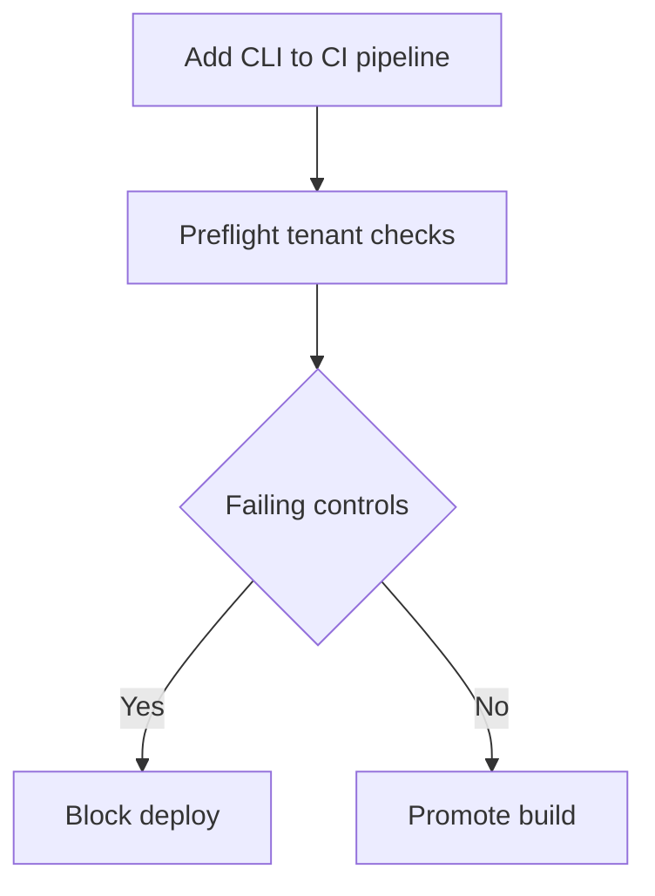

---

### 12) Regulator/Assessor – "Independent Verifier"

| Before | After |
|--------|-------|
| Trust auditor word and screenshots | Replay package with full trace |
| No way to verify reasoning | Chain-of-Thought logs inspectable |
| Integrity disputes are common | Timestamped approvals prove compliance |

```mermaid
flowchart LR
    A[Receive replay package] --> B[Inspect Chain-of-Thought logs]
    B --> C[Verify timestamps and approvals]
    C --> D{Integrity holds}
    D -->|Yes| E[Accept audit]
    D -->|No| F[Request clarification]
  ```

---

## 🚀 Quick Start

### Prerequisites
*   Docker (Desktop or Engine)
*   Python 3.10+
*   OpenAI API Key (or Azure/Ollama equivalent)

### Installation

```bash
# 1. Setup environment
python3 -m venv .venv
source .venv/bin/activate
pip install magentic-ui --upgrade

# 2. Set your API key
export OPENAI_API_KEY="your-api-key-here"

# 3. Launch FARA-GRC
magentic-ui --port 8081
```

Open **http://localhost:8081** to access the FARA-GRC dashboard.

---

## 📚 Citation

If you use FARA-GRC in your research, please cite the underlying Magentic-UI framework:

```bibtex
@article{mozannar2025magentic,
  title={Magentic-UI: Towards Human-in-the-loop Agentic Systems},
  author={Mozannar, Hussein and Bansal, Gagan and Tan, Cheng and Fourney, Adam and Dibia, Victor and Chen, Jingya and Gerrits, Jack and Payne, Tyler and Maldaner, Matheus Kunzler and Grunde-McLaughlin, Madeleine and others},
  journal={arXiv preprint arXiv:2507.22358},
  year={2025}
}
```

---

<div align="center">
  <a href="#demos">🎬 Demos</a> &nbsp;|&nbsp;
  <a href="#how-it-works">🟪 How it Works</a> &nbsp;|&nbsp;
  <a href="#installation">🛠️ Installation</a> &nbsp;|&nbsp;
  <a href="#troubleshooting">⚠️ Troubleshooting</a> &nbsp;|&nbsp; 
  <a href="#contributing">🤝 Contributing</a> &nbsp;|&nbsp;
  <a href="#license">📄 License</a>
</div>
