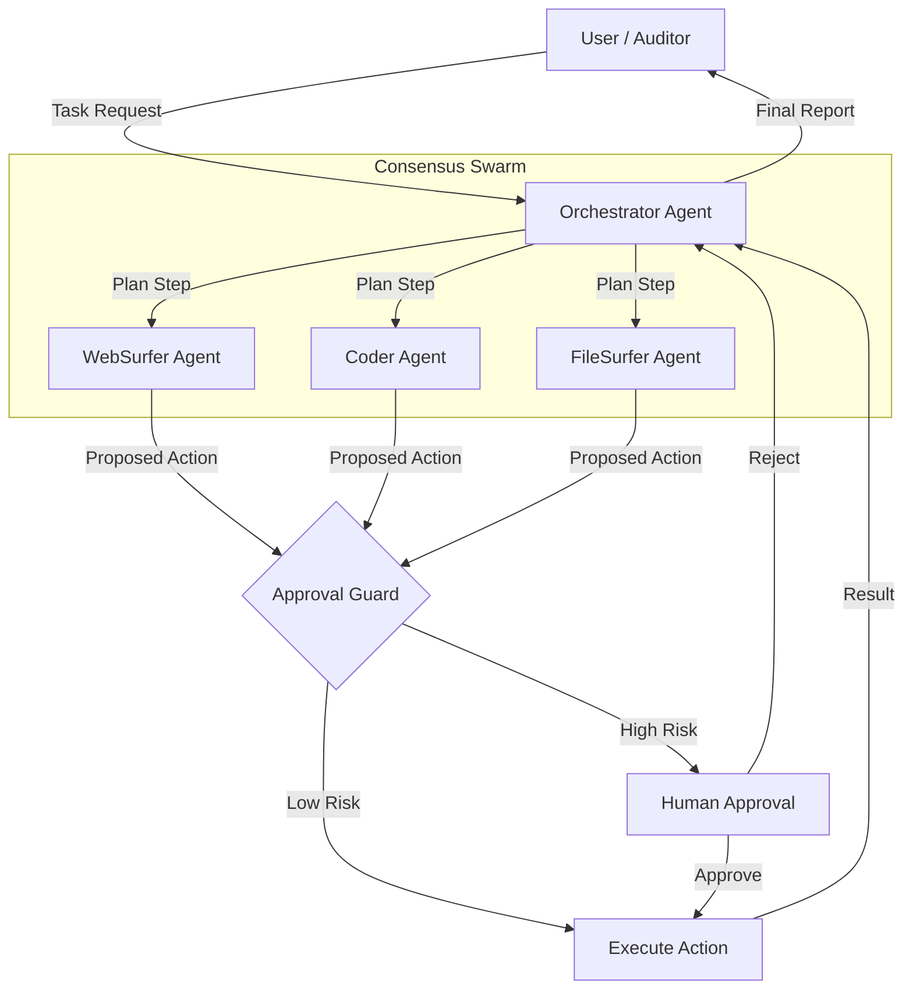

<div align="center">

# FARA-GRC
### Forensic AI-Reasoned Automation for Governance, Risk & Compliance

_The AI-Native Compliance Platform for the Future of Auditing_

[](https://pypi.python.org/pypi/magentic_ui)
[](https://pypi.python.org/pypi/magentic_ui)

[](https://arxiv.org/abs/2507.22358)

</div>

---

**FARA-GRC** is a research prototype and enterprise platform that reimagines compliance auditing from first principles. Built on top of Microsoft's **Magentic-UI**, it transforms the manual, error-prone process of M365 auditing into an automated, forensic-grade workflow powered by multi-agent AI systems.

Unlike black-box automation tools, FARA-GRC is designed with **forensic integrity** at its core, using mathematical principles to ensure every action is reasoned, auditable, and verifiable.

## 🧠 Mathematical Foundations: Science, Not Magic

FARA-GRC is grounded in three core mathematical frameworks that ensure reliability and trust.

### 1. Shannon's Information Theory (Signal-to-Noise)
We treat audit evidence as a signal processing problem. The goal is to maximize the **Signal-to-Noise Ratio (S/N)** of audit findings.

$$ S/N = 10 \log_{10} \left( \frac{P_{signal}}{P_{noise}} \right) $$

*   **What it means:** Like tuning a radio, we filter out static (irrelevant logs) to capture clear signals (critical non-compliance events).
*   **FARA-GRC Target:** S/N > 100 (100x more useful info than noise).

### 2. Bayesian Decision Theory (Risk Assessment)
Every action taken by our agents is evaluated using probabilistic risk assessment.

$$ Risk = P(event) \times Cost(event) $$

*   **How it works:** The **Action Guard** calculates the probability and cost of failure for every step.
    *   **Low Risk:** Navigation actions (e.g., clicking "Next") → **Auto-Approved (95%)**
    *   **High Risk:** Data modification (e.g., deleting policies) → **Human Approval Required (100%)**

### 3. Multi-Agent Consensus (Byzantine Fault Tolerance)
We employ a "Consensus Swarm" architecture where multiple specialized agents must agree on a finding before it is flagged.

$$ Consensus = \frac{n-1}{3} \text{ fault tolerance} $$

*   **The Principle:** Like a panel of judges. If the **WebSurfer** (browser), **Coder** (scripting), and **FileSurfer** (analysis) agents disagree, the system halts and requests human intervention, preventing hallucinations from polluting the audit report.

---

## 🏗️ System Architecture

FARA-GRC uses a hub-and-spoke architecture where the **Orchestrator** manages a team of specialized agents, protected by an **Approval Guard**.



### Key Components
*   **Orchestrator:** The "brain" that plans the audit workflow and delegates tasks.
*   **WebSurfer:** Navigates M365 Admin Centers and compliance portals.
*   **Coder:** Writes Python scripts to analyze exported logs and data.
*   **FileSurfer:** Reads and parses policy documents and evidence files.
*   **Approval Guard:** The "firewall" that enforces safety policies based on Bayesian risk assessment.

---

## 🚀 Quick Start

Get FARA-GRC running in minutes.

### Prerequisites
*   Docker (Desktop or Engine)
*   Python 3.10+
*   OpenAI API Key (or Azure/Ollama equivalent)

### Installation

```bash
# 1. Setup environment
python3 -m venv .venv
source .venv/bin/activate
pip install magentic-ui --upgrade

# 2. Set your API key
export OPENAI_API_KEY="your-api-key-here"

# 3. Launch FARA-GRC
magentic-ui --port 8081
```

Open **http://localhost:8081** to access the FARA-GRC dashboard.

---

## ✨ Key Features

*   **"Tell Me When" Monitoring:** Set up long-running agents that monitor compliance status (e.g., "Alert me if MFA is disabled for any admin user") and wait for days or weeks.
*   **Forensic Evidence Capture:** Automatically captures screenshots, DOM snapshots, and network logs for every step, creating an immutable audit trail.
*   **Human-in-the-Loop:** You are always in control. Pause, guide, or take over the agent at any moment.
*   **Template Marketplace:** (Coming Soon) Pre-built audit workflows for ISO 27001, SOC 2, and GDPR.

---

## 📚 Research & Citation

FARA-GRC is built upon the research foundations of Magentic-UI. If you use this work, please cite the original paper:

```bibtex
@article{mozannar2025magentic,
  title={Magentic-UI: Towards Human-in-the-loop Agentic Systems},
  author={Mozannar, Hussein and Bansal, Gagan and Tan, Cheng and Fourney, Adam and Dibia, Victor and Chen, Jingya and Gerrits, Jack and Payne, Tyler and Maldaner, Matheus Kunzler and Grunde-McLaughlin, Madeleine and others},
  journal={arXiv preprint arXiv:2507.22358},
  year={2025}
}
```

---

<div align="center">
  <a href="#demos">🎬 Demos</a> &nbsp;|&nbsp;
  <a href="#how-it-works">🟪 How it Works</a> &nbsp;|&nbsp;
  <a href="#installation">🛠️ Installation</a> &nbsp;|&nbsp;
  <a href="#troubleshooting">⚠️ Troubleshooting</a> &nbsp;|&nbsp; 
  <a href="#contributing">🤝 Contributing</a> &nbsp;|&nbsp;
  <a href="#license">📄 License</a>
</div>

